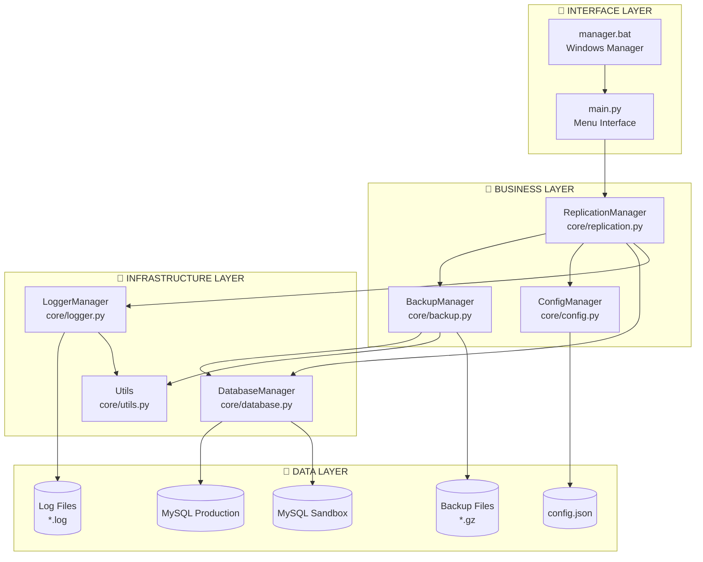
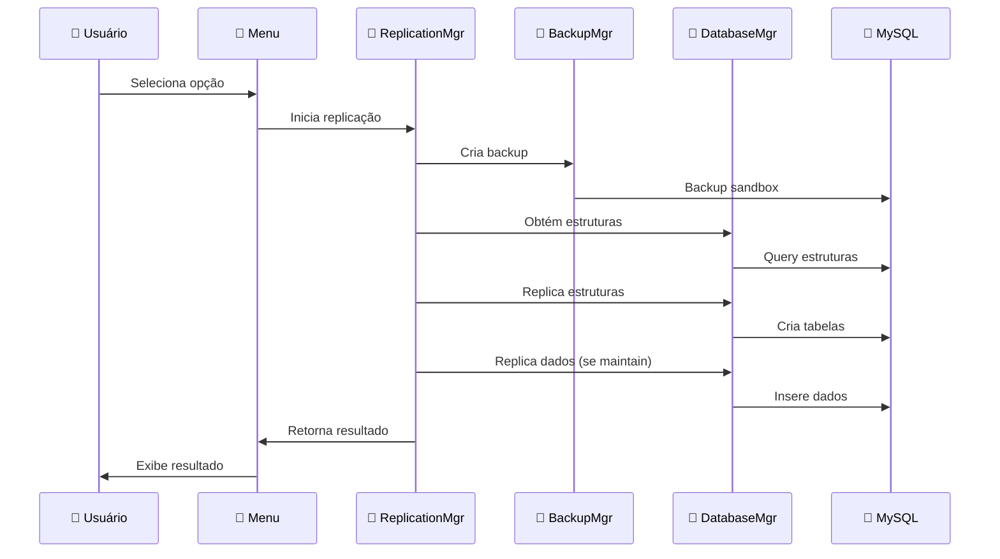

# 🧩 Diagrama de Componentes - ReplicOOP

## 📊 Arquitetura de Componentes



## 🎯 Detalhamento dos Componentes

### 🎨 **INTERFACE LAYER**

#### `main.py` - Menu Interface
```python
class ReplicOOPMenu:
    """Interface principal do usuário"""
    
    # Principais responsabilidades:
    - Apresenta menu interativo
    - Captura entrada do usuário
    - Delega operações para ReplicationManager
    - Exibe resultados formatados
    
    # Métodos principais:
    - show_main_menu(): Exibe menu principal
    - handle_option(): Processa opção selecionada
    - display_results(): Formata saída
```

#### `manager.bat` - Windows Manager
```batch
# Script de gerenciamento Windows
# Funcionalidades:
- Instala dependências
- Cria ambiente virtual
- Executa sistema
- Gerencia ambiente Python
```

### 🏢 **BUSINESS LAYER**

#### `ReplicationManager` - Motor Principal
```python
class ReplicationManager:
    """Orquestrador principal do sistema"""
    
    # Responsabilidades principais:
    - Coordena processo de replicação
    - Implementa regras de negócio
    - Gerencia transações
    - Trata erros e rollbacks
    
    # Métodos críticos:
    - replicate_database(): Processo principal
    - replicate_structure_only(): Só estrutura
    - replicate_data_and_structure(): Dados + estrutura
    - handle_foreign_keys(): Gerencia FKs
    - validate_replication(): Valida resultado
```

#### `BackupManager` - Sistema de Backup
```python
class BackupManager:
    """Gerencia backups de segurança"""
    
    # Funcionalidades:
    - Backup automático antes de operações
    - Compressão gzip dos backups
    - Rotação de backups antigos
    - Restore em caso de falha
    
    # Métodos essenciais:
    - create_backup(): Cria backup
    - compress_backup(): Comprime arquivo
    - restore_backup(): Restaura backup
    - cleanup_old_backups(): Remove antigos
```

#### `ConfigManager` - Configurações
```python
class ConfigManager:
    """Gerencia configurações do sistema"""
    
    # Responsabilidades:
    - Carrega config.json
    - Valida configurações
    - Fornece acesso centralizado
    - Gerencia ambientes
    
    # Métodos principais:
    - load_config(): Carrega configuração
    - get_database_config(): Config de BD
    - get_maintain_tables(): Tabelas maintain
    - validate_config(): Valida parâmetros
```

### 🔧 **INFRASTRUCTURE LAYER**

#### `DatabaseManager` - Interface MySQL
```python
class DatabaseManager:
    """Interface com bancos MySQL"""
    
    # Funcionalidades principais:
    - Gerencia conexões MySQL
    - Executa queries SQL
    - Trata transações
    - Gerencia pools de conexão
    
    # Métodos críticos:
    - get_connection(): Obtém conexão
    - execute_query(): Executa SQL
    - get_table_structure(): Estrutura tabela
    - get_table_data(): Dados da tabela
    - drop_foreign_keys(): Remove FKs
    - create_table(): Cria tabela
    - insert_data(): Insere dados
```

#### `LoggerManager` - Sistema de Logs
```python
class LoggerManager:
    """Sistema de logging e auditoria"""
    
    # Capacidades:
    - Logs estruturados
    - Diferentes níveis (INFO, ERROR, etc)
    - Rotação de arquivos
    - Formatação consistente
    
    # Métodos principais:
    - setup_logger(): Configura logger
    - log_operation(): Registra operação
    - log_error(): Registra erro
    - generate_report(): Gera relatório
```

#### `Utils` - Utilitários
```python
class Utils:
    """Funções utilitárias do sistema"""
    
    # Utilidades oferecidas:
    - Formatação de dados
    - Manipulação de strings
    - Validações diversas
    - Helpers para outras classes
    
    # Métodos úteis:
    - format_size(): Formata tamanhos
    - safe_filename(): Nome seguro arquivo
    - validate_table_name(): Valida nome tabela
    - progress_callback(): Callback progresso
```

### 💾 **DATA LAYER**

#### Bancos MySQL
```sql
-- MySQL Production
-- Banco de origem dos dados
-- Estrutura e dados reais

-- MySQL Sandbox  
-- Banco de destino
-- Replica estrutura/dados conforme config
```

#### Sistema de Arquivos
```
backups/
├── backup_20241201_143022.sql.gz  # Backups comprimidos
├── backup_20241201_152315.sql.gz
└── ...

logs/
├── replicoop_20241201.log         # Logs diários
├── replicoop_20241202.log
└── ...
```

## 🔄 Fluxo de Dados

### Processo de Replicação


## 🔗 Dependências entre Componentes

### Matriz de Dependências
```
                  │ Rep │ Bkp │ Cfg │ Db  │ Log │ Utils │
──────────────────┼─────┼─────┼─────┼─────┼─────┼───────┤
ReplicationMgr    │  -  │  ✓  │  ✓  │  ✓  │  ✓  │   ✓   │
BackupMgr         │  -  │  -  │  ✓  │  ✓  │  ✓  │   ✓   │
ConfigMgr         │  -  │  -  │  -  │  -  │  ✓  │   ✓   │
DatabaseMgr       │  -  │  -  │  ✓  │  -  │  ✓  │   ✓   │
LoggerMgr         │  -  │  -  │  -  │  -  │  -  │   ✓   │
Utils             │  -  │  -  │  -  │  -  │  -  │   -   │
```

### Regras de Dependência
1. **Utils** não depende de ninguém (base)
2. **LoggerMgr** só depende de Utils
3. **ConfigMgr** só depende de Utils e LoggerMgr
4. **DatabaseMgr** depende de Config, Logger e Utils
5. **BackupMgr** depende de Database, Config, Logger e Utils
6. **ReplicationMgr** é o orquestrador (depende de todos)

## 🎛️ Configuração de Componentes

### `config.json` - Estrutura
```json
{
  "databases": {
    "production": {
      "host": "prod-server",
      "user": "prod-user",
      "password": "prod-pass",
      "database": "prod-db"
    },
    "sandbox": {
      "host": "sand-server", 
      "user": "sand-user",
      "password": "sand-pass",
      "database": "sand-db"
    }
  },
  "maintain": [
    "usuarios",
    "produtos", 
    "configuracoes"
  ],
  "backup": {
    "enabled": true,
    "compression": true,
    "retention_days": 7
  },
  "logging": {
    "level": "INFO",
    "max_file_size": "10MB",
    "backup_count": 5
  }
}
```

## 🔒 Segurança dos Componentes

### Credenciais
- **Armazenamento**: config.json (não versionado)
- **Acesso**: Apenas ConfigManager lê credenciais
- **Transmissão**: Conexões MySQL seguras

### Validações
- **Input**: Validação em todas as entradas
- **SQL**: Prepared statements (proteção SQL injection)
- **Arquivos**: Validação de caminhos e permissões

### Backup de Segurança
- **Automático**: Antes de operações destrutivas
- **Comprimido**: Para economizar espaço
- **Rotação**: Remove backups antigos

## 📊 Métricas dos Componentes

### Performance
```python
COMPONENT_METRICS = {
    'ReplicationManager': {
        'avg_execution_time': '2-5 minutes',
        'memory_usage': '50-100MB',
        'cpu_usage': 'Medium'
    },
    'DatabaseManager': {
        'connection_pool': '5 connections max',
        'query_timeout': '30 seconds',
        'transaction_timeout': '5 minutes'
    },
    'BackupManager': {
        'compression_ratio': '60-80%',
        'backup_time': '30-60 seconds',
        'disk_usage': 'Variable'
    }
}
```

### Limites
```python
SYSTEM_LIMITS = {
    'max_table_size': '1GB per table',
    'max_databases': 'Unlimited',
    'max_backup_retention': '30 days',
    'max_log_file_size': '100MB',
    'max_concurrent_operations': 1
}
```

---

**Próximo**: [Fluxo de Dados](data-flow.md)