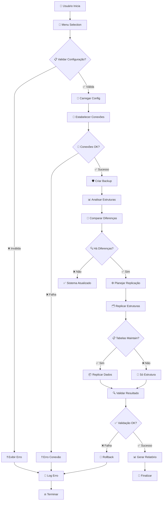
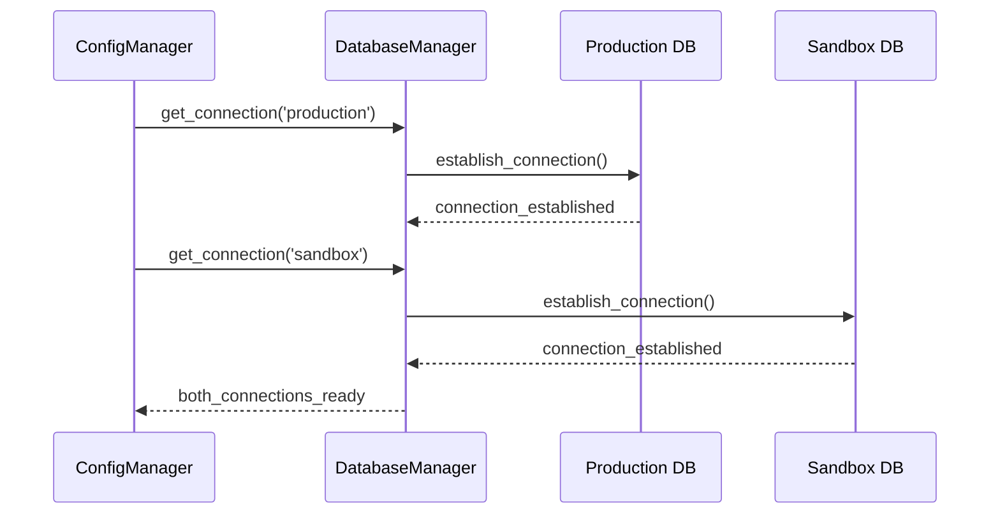
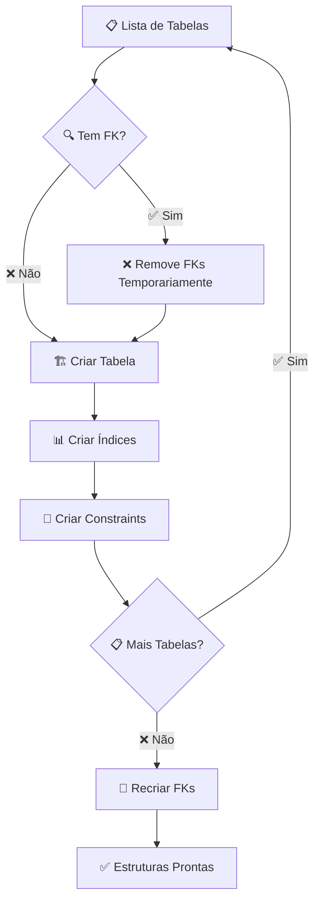

# 🌊 Fluxo de Dados - ReplicOOP

## 📊 Visão Geral do Fluxo

O **ReplicOOP** processa dados através de um pipeline bem definido que garante consistência e segurança durante a replicação.



## 🔄 Detalhamento das Fases

### 🎯 **Fase 1: Inicialização**

#### Entrada do Usuário
```python
# Fluxo de entrada
User Input → Menu System → Option Validation → Configuration Loading

# Dados processados:
- Opção selecionada pelo usuário
- Parâmetros de configuração
- Validação de credenciais
- Verificação de conectividade
```

#### Processamento de Configuração
```python
def load_configuration():
    """Carrega e valida configuração"""
    
    # 1. Lê config.json
    config_data = json.load('config.json')
    
    # 2. Valida estrutura
    validate_config_structure(config_data)
    
    # 3. Testa conectividade
    test_database_connections(config_data)
    
    # 4. Carrega tabelas maintain
    maintain_tables = config_data.get('maintain', [])
    
    return config_data, maintain_tables
```

### 🔐 **Fase 2: Preparação**

#### Estabelecimento de Conexões


#### Criação de Backup
```python
def create_safety_backup():
    """Cria backup de segurança antes da replicação"""
    
    # 1. Gera timestamp único
    timestamp = datetime.now().strftime('%Y%m%d_%H%M%S')
    
    # 2. Executa mysqldump
    backup_file = f"backup_{timestamp}.sql"
    mysqldump_command = build_mysqldump_command(sandbox_config, backup_file)
    
    # 3. Comprime arquivo
    compressed_file = f"{backup_file}.gz"
    compress_with_gzip(backup_file, compressed_file)
    
    # 4. Remove arquivo original
    os.remove(backup_file)
    
    return compressed_file
```

### 📊 **Fase 3: Análise**

#### Coleta de Estruturas
```python
def analyze_database_structures():
    """Analisa estruturas dos bancos de dados"""
    
    # Estruturas do banco de produção
    prod_tables = get_all_tables(production_conn)
    prod_structures = {}
    
    for table in prod_tables:
        prod_structures[table] = {
            'columns': get_table_columns(production_conn, table),
            'indexes': get_table_indexes(production_conn, table),
            'foreign_keys': get_foreign_keys(production_conn, table),
            'constraints': get_table_constraints(production_conn, table)
        }
    
    # Estruturas do sandbox
    sand_tables = get_all_tables(sandbox_conn)
    sand_structures = {}
    
    for table in sand_tables:
        sand_structures[table] = get_table_structure(sandbox_conn, table)
    
    return prod_structures, sand_structures
```

#### Comparação e Diferenças
```python
def compare_structures(prod_structures, sand_structures):
    """Compara estruturas e identifica diferenças"""
    
    differences = {
        'new_tables': [],      # Tabelas que precisam ser criadas
        'modified_tables': [], # Tabelas com estrutura diferente
        'deleted_tables': [],  # Tabelas que existem no sandbox mas não na prod
        'new_columns': {},     # Novas colunas por tabela
        'modified_columns': {} # Colunas modificadas por tabela
    }
    
    # Identifica tabelas novas
    for table in prod_structures:
        if table not in sand_structures:
            differences['new_tables'].append(table)
        else:
            # Compara estruturas existentes
            compare_table_structures(
                table, 
                prod_structures[table], 
                sand_structures[table], 
                differences
            )
    
    return differences
```

### ⚙️ **Fase 4: Planejamento**

#### Ordem de Execução
```python
def plan_replication_order(differences, maintain_tables):
    """Planeja ordem de replicação considerando dependências"""
    
    execution_plan = {
        'phase_1_structure': [],  # Apenas estrutura
        'phase_2_data': [],       # Estrutura + dados (maintain)
        'phase_3_cleanup': []     # Limpeza e validação
    }
    
    # Ordena tabelas por dependências (FK)
    ordered_tables = sort_tables_by_dependencies(differences['new_tables'])
    
    for table in ordered_tables:
        if table in maintain_tables:
            execution_plan['phase_2_data'].append(table)
        else:
            execution_plan['phase_1_structure'].append(table)
    
    return execution_plan
```

### 🗂️ **Fase 5: Execução de Estruturas**

#### Replicação de Estruturas


#### Código de Replicação de Estrutura
```python
def replicate_table_structure(table_name, structure):
    """Replica estrutura de uma tabela"""
    
    try:
        # 1. Remove FKs problemáticas temporariamente
        foreign_keys = structure.get('foreign_keys', [])
        if foreign_keys:
            drop_foreign_keys(sandbox_conn, table_name)
        
        # 2. Drop tabela se existir
        drop_table_if_exists(sandbox_conn, table_name)
        
        # 3. Cria nova tabela
        create_table_sql = build_create_table_sql(table_name, structure)
        execute_sql(sandbox_conn, create_table_sql)
        
        # 4. Cria índices
        for index in structure.get('indexes', []):
            create_index_sql = build_create_index_sql(table_name, index)
            execute_sql(sandbox_conn, create_index_sql)
        
        # 5. Registra sucesso
        logger.info(f"Estrutura da tabela {table_name} replicada com sucesso")
        
    except Exception as e:
        logger.error(f"Erro ao replicar estrutura da tabela {table_name}: {e}")
        raise
```

### 📦 **Fase 6: Replicação de Dados**

#### Fluxo de Dados para Tabelas Maintain
```python
def replicate_table_data(table_name):
    """Replica dados de tabelas marcadas como maintain"""
    
    # 1. Conta registros na origem
    count_sql = f"SELECT COUNT(*) FROM {table_name}"
    total_records = execute_scalar(production_conn, count_sql)
    
    if total_records == 0:
        logger.info(f"Tabela {table_name} está vazia")
        return
    
    # 2. Seleciona dados em lotes
    batch_size = 1000
    offset = 0
    
    with tqdm(total=total_records, desc=f"Replicando {table_name}") as pbar:
        while offset < total_records:
            # Busca lote de dados
            select_sql = f"""
                SELECT * FROM {table_name} 
                LIMIT {batch_size} OFFSET {offset}
            """
            batch_data = execute_query(production_conn, select_sql)
            
            # Insere lote no sandbox
            if batch_data:
                insert_batch_data(sandbox_conn, table_name, batch_data)
                pbar.update(len(batch_data))
            
            offset += batch_size
    
    logger.info(f"Replicação de dados da tabela {table_name} concluída")
```

#### Otimização de Performance
```python
def optimize_data_replication():
    """Otimizações para performance"""
    
    # 1. Desabilita autocommit para transações em lote
    sandbox_conn.autocommit = False
    
    # 2. Aumenta tamanhos de buffer
    execute_sql(sandbox_conn, "SET SESSION bulk_insert_buffer_size = 268435456")
    execute_sql(sandbox_conn, "SET SESSION max_heap_table_size = 268435456")
    
    # 3. Desabilita verificação de FK durante inserção
    execute_sql(sandbox_conn, "SET FOREIGN_KEY_CHECKS = 0")
    
    return lambda: restore_default_settings()
```

### 🔍 **Fase 7: Validação**

#### Validação de Integridade
```python
def validate_replication_integrity():
    """Valida integridade da replicação"""
    
    validation_results = {
        'structure_validation': True,
        'data_validation': True,
        'constraint_validation': True,
        'errors': []
    }
    
    try:
        # 1. Valida estruturas
        validate_table_structures(validation_results)
        
        # 2. Valida contagem de dados (tabelas maintain)
        validate_data_counts(validation_results)
        
        # 3. Valida constraints e FKs
        validate_constraints(validation_results)
        
    except Exception as e:
        validation_results['errors'].append(str(e))
    
    return validation_results
```

### 📊 **Fase 8: Relatório**

#### Geração de Relatório
```python
def generate_replication_report(results):
    """Gera relatório detalhado da replicação"""
    
    report = {
        'timestamp': datetime.now(),
        'execution_time': results['end_time'] - results['start_time'],
        'tables_processed': len(results['tables']),
        'maintain_tables': len(results['maintain_tables']),
        'structure_only_tables': len(results['structure_tables']),
        'total_records_replicated': results['total_records'],
        'backup_created': results['backup_file'],
        'success': results['success'],
        'errors': results.get('errors', [])
    }
    
    # Formata relatório para exibição
    formatted_report = format_report_for_display(report)
    
    # Salva em arquivo
    save_report_to_file(report)
    
    return formatted_report
```

## 🔄 Fluxos de Dados Específicos

### 💾 **Fluxo de Backup**
```
Sandbox DB → mysqldump → backup.sql → gzip → backup.sql.gz → storage/
```

### 📊 **Fluxo de Estrutura**
```
Production DB → SHOW CREATE TABLE → Parse Structure → Adapt to Sandbox → CREATE TABLE
```

### 📦 **Fluxo de Dados (Maintain)**
```
Production DB → SELECT * → Batch Processing → INSERT INTO → Sandbox DB
```

### 📜 **Fluxo de Logs**
```
Operations → LoggerManager → Format → File Writer → replicoop_YYYYMMDD.log
```

## 🚨 Tratamento de Erros no Fluxo

### Estratégias de Recuperação
```python
ERROR_RECOVERY_STRATEGIES = {
    'connection_error': {
        'strategy': 'retry_with_backoff',
        'max_attempts': 3,
        'backoff_factor': 2
    },
    'foreign_key_error': {
        'strategy': 'disable_fk_and_continue',
        'fallback': 'log_warning'
    },
    'data_too_large_error': {
        'strategy': 'reduce_batch_size',
        'min_batch_size': 100
    },
    'disk_space_error': {
        'strategy': 'cleanup_old_backups',
        'then': 'retry_operation'
    }
}
```

### Pontos de Checkpoint
```python
CHECKPOINTS = {
    'config_loaded': 'Configuração carregada com sucesso',
    'connections_established': 'Conexões estabelecidas',
    'backup_created': 'Backup de segurança criado',
    'structures_analyzed': 'Estruturas analisadas',
    'replication_planned': 'Plano de replicação criado',
    'structures_replicated': 'Estruturas replicadas',
    'data_replicated': 'Dados replicados',
    'validation_completed': 'Validação concluída',
    'operation_finished': 'Operação finalizada'
}
```

---

**Próximo**: [Padrões de Design](design-patterns.md)