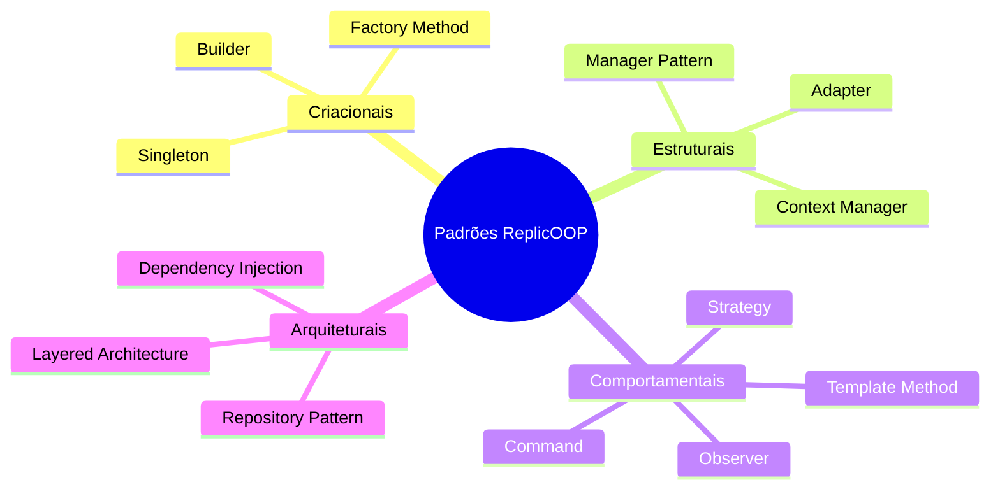

# 🎨 Padrões de Design - ReplicOOP

## 📋 Visão Geral dos Padrões

O **ReplicOOP** implementa diversos padrões de design consagrados para garantir código limpo, manutenível e extensível.



## 🏗️ Padrões Criacionais

### 🏭 **Factory Method**

Utilizado para criar instâncias de conexões de banco de dados baseadas na configuração.

```python
class DatabaseConnectionFactory:
    """Factory para criação de conexões de banco"""
    
    @staticmethod
    def create_connection(config_type: str, config: dict):
        """Cria conexão baseada no tipo de configuração"""
        
        if config_type == 'mysql_connector':
            return mysql.connector.connect(
                host=config['host'],
                user=config['user'],
                password=config['password'],
                database=config['database'],
                charset='utf8mb4'
            )
        elif config_type == 'pymysql':
            return pymysql.connect(
                host=config['host'],
                user=config['user'],
                password=config['password'],
                database=config['database'],
                charset='utf8mb4'
            )
        else:
            raise ValueError(f"Tipo de conexão não suportado: {config_type}")

# Uso do padrão
class DatabaseManager:
    def get_connection(self, environment: str):
        config = self.config_manager.get_database_config(environment)
        return DatabaseConnectionFactory.create_connection('mysql_connector', config)
```

**Vantagens:**
- Facilita adição de novos tipos de conexão
- Isola lógica de criação
- Facilita testes com mocks

### 🔐 **Singleton**

Garante uma única instância de managers críticos como `LoggerManager` e `ConfigManager`.

```python
class ConfigManager:
    """Singleton para gerenciamento de configuração"""
    
    _instance = None
    _config = None
    
    def __new__(cls):
        if cls._instance is None:
            cls._instance = super(ConfigManager, cls).__new__(cls)
        return cls._instance
    
    def load_config(self):
        """Carrega configuração apenas uma vez"""
        if self._config is None:
            with open('config.json', 'r', encoding='utf-8') as file:
                self._config = json.load(file)
        return self._config
    
    def get_database_config(self, environment: str):
        """Retorna configuração do ambiente específico"""
        config = self.load_config()
        return config['databases'][environment]

# Uso do singleton
config_manager = ConfigManager()  # Primeira instância
same_manager = ConfigManager()    # Mesma instância
assert config_manager is same_manager  # True
```

**Vantagens:**
- Economia de recursos
- Estado centralizado
- Evita múltiplas cargas de configuração

### 🔨 **Builder**

Usado para construir queries SQL complexas de forma flexível.

```python
class SQLQueryBuilder:
    """Builder para construção de queries SQL"""
    
    def __init__(self):
        self.reset()
    
    def reset(self):
        """Reinicia o builder"""
        self._query_parts = {
            'select': [],
            'from': '',
            'where': [],
            'join': [],
            'order_by': [],
            'limit': ''
        }
        return self
    
    def select(self, *columns):
        """Adiciona colunas ao SELECT"""
        self._query_parts['select'].extend(columns)
        return self
    
    def from_table(self, table):
        """Define tabela principal"""
        self._query_parts['from'] = table
        return self
    
    def where(self, condition):
        """Adiciona condição WHERE"""
        self._query_parts['where'].append(condition)
        return self
    
    def join(self, table, condition):
        """Adiciona JOIN"""
        self._query_parts['join'].append(f"JOIN {table} ON {condition}")
        return self
    
    def order_by(self, column, direction='ASC'):
        """Adiciona ORDER BY"""
        self._query_parts['order_by'].append(f"{column} {direction}")
        return self
    
    def limit(self, count):
        """Adiciona LIMIT"""
        self._query_parts['limit'] = f"LIMIT {count}"
        return self
    
    def build(self):
        """Constrói a query final"""
        query_parts = []
        
        # SELECT
        if self._query_parts['select']:
            columns = ', '.join(self._query_parts['select'])
            query_parts.append(f"SELECT {columns}")
        
        # FROM
        if self._query_parts['from']:
            query_parts.append(f"FROM {self._query_parts['from']}")
        
        # JOIN
        if self._query_parts['join']:
            query_parts.extend(self._query_parts['join'])
        
        # WHERE
        if self._query_parts['where']:
            conditions = ' AND '.join(self._query_parts['where'])
            query_parts.append(f"WHERE {conditions}")
        
        # ORDER BY
        if self._query_parts['order_by']:
            order_clause = ', '.join(self._query_parts['order_by'])
            query_parts.append(f"ORDER BY {order_clause}")
        
        # LIMIT
        if self._query_parts['limit']:
            query_parts.append(self._query_parts['limit'])
        
        return ' '.join(query_parts)

# Uso do Builder
query = (SQLQueryBuilder()
    .select('id', 'name', 'email')
    .from_table('users')
    .where('active = 1')
    .where('created_at > "2024-01-01"')
    .order_by('name')
    .limit(100)
    .build())

# Resultado: SELECT id, name, email FROM users WHERE active = 1 AND created_at > "2024-01-01" ORDER BY name LIMIT 100
```

## 🏛️ Padrões Estruturais

### 🎯 **Manager Pattern**

Cada responsabilidade principal tem seu próprio manager.

```python
class ReplicationManager:
    """Manager principal que orquestra a replicação"""
    
    def __init__(self):
        self.config_manager = ConfigManager()
        self.database_manager = DatabaseManager()
        self.backup_manager = BackupManager()
        self.logger_manager = LoggerManager()
    
    def replicate_database(self, source_env: str, target_env: str):
        """Orquestra todo o processo de replicação"""
        try:
            # 1. Carrega configuração
            config = self.config_manager.load_config()
            
            # 2. Cria backup de segurança
            backup_file = self.backup_manager.create_backup(target_env)
            
            # 3. Executa replicação
            result = self._execute_replication(source_env, target_env)
            
            # 4. Valida resultado
            if not self._validate_replication(result):
                self._rollback_from_backup(backup_file)
                raise ReplicationError("Validação falhou")
            
            # 5. Log de sucesso
            self.logger_manager.log_success("Replicação concluída", result)
            
            return result
            
        except Exception as e:
            self.logger_manager.log_error("Falha na replicação", e)
            raise
```

**Vantagens:**
- Separação clara de responsabilidades
- Facilita testes unitários
- Código mais organizado e legível

### 🔄 **Context Manager**

Garante fechamento automático de recursos como conexões de banco.

```python
class DatabaseConnection:
    """Context manager para conexões de banco"""
    
    def __init__(self, config):
        self.config = config
        self.connection = None
    
    def __enter__(self):
        """Abre conexão ao entrar no context"""
        self.connection = mysql.connector.connect(**self.config)
        return self.connection
    
    def __exit__(self, exc_type, exc_val, exc_tb):
        """Fecha conexão ao sair do context"""
        if self.connection:
            if exc_type:
                # Rollback em caso de erro
                self.connection.rollback()
            else:
                # Commit se tudo ocorreu bem
                self.connection.commit()
            
            self.connection.close()

# Uso do Context Manager
def execute_safe_operation():
    config = get_database_config('sandbox')
    
    with DatabaseConnection(config) as conn:
        cursor = conn.cursor()
        cursor.execute("INSERT INTO test_table VALUES (1, 'test')")
        # Conexão automaticamente fechada e commitada
```

### 🔌 **Adapter Pattern**

Adapta diferentes drivers MySQL para uma interface comum.

```python
class DatabaseAdapter:
    """Adapter para diferentes drivers MySQL"""
    
    def __init__(self, driver_type: str, config: dict):
        self.driver_type = driver_type
        self.config = config
        self.connection = None
    
    def connect(self):
        """Conecta usando o driver apropriado"""
        if self.driver_type == 'mysql_connector':
            self.connection = mysql.connector.connect(**self.config)
        elif self.driver_type == 'pymysql':
            self.connection = pymysql.connect(**self.config)
    
    def execute_query(self, query: str, params=None):
        """Executa query adaptando para o driver específico"""
        cursor = self.connection.cursor()
        
        if self.driver_type == 'mysql_connector':
            cursor.execute(query, params or ())
            return cursor.fetchall()
        elif self.driver_type == 'pymysql':
            cursor.execute(query, params)
            return cursor.fetchall()
    
    def close(self):
        """Fecha conexão"""
        if self.connection:
            self.connection.close()
```

## 🎭 Padrões Comportamentais

### 🎬 **Command Pattern**

Cada opção do menu é implementada como um comando.

```python
from abc import ABC, abstractmethod

class Command(ABC):
    """Interface base para comandos"""
    
    @abstractmethod
    def execute(self):
        pass
    
    @abstractmethod
    def get_description(self):
        pass

class ReplicateStructureCommand(Command):
    """Comando para replicar apenas estrutura"""
    
    def __init__(self, replication_manager):
        self.replication_manager = replication_manager
    
    def execute(self):
        """Executa replicação de estrutura"""
        return self.replication_manager.replicate_structure_only(
            'production', 'sandbox'
        )
    
    def get_description(self):
        return "Replica apenas estruturas das tabelas"

class ReplicateDataCommand(Command):
    """Comando para replicar estrutura e dados"""
    
    def __init__(self, replication_manager):
        self.replication_manager = replication_manager
    
    def execute(self):
        """Executa replicação completa"""
        return self.replication_manager.replicate_database(
            'production', 'sandbox'
        )
    
    def get_description(self):
        return "Replica estrutura e dados das tabelas maintain"

class MenuInvoker:
    """Invoker que executa comandos do menu"""
    
    def __init__(self):
        self.commands = {}
        self.history = []
    
    def register_command(self, option: str, command: Command):
        """Registra comando para uma opção"""
        self.commands[option] = command
    
    def execute_command(self, option: str):
        """Executa comando da opção"""
        if option in self.commands:
            command = self.commands[option]
            result = command.execute()
            self.history.append((option, command, result))
            return result
        else:
            raise ValueError(f"Comando não encontrado para opção: {option}")
    
    def get_command_description(self, option: str):
        """Retorna descrição do comando"""
        return self.commands[option].get_description()

# Uso do Command Pattern
menu = MenuInvoker()
replication_manager = ReplicationManager()

# Registra comandos
menu.register_command('1', ReplicateStructureCommand(replication_manager))
menu.register_command('2', ReplicateDataCommand(replication_manager))

# Executa comando baseado na entrada do usuário
user_choice = input("Escolha uma opção: ")
result = menu.execute_command(user_choice)
```

### 🎯 **Strategy Pattern**

Diferentes estratégias de backup e replicação.

```python
from abc import ABC, abstractmethod

class BackupStrategy(ABC):
    """Interface para estratégias de backup"""
    
    @abstractmethod
    def create_backup(self, database_config: dict) -> str:
        pass
    
    @abstractmethod
    def restore_backup(self, backup_file: str, database_config: dict):
        pass

class MySQLDumpBackupStrategy(BackupStrategy):
    """Estratégia de backup usando mysqldump"""
    
    def create_backup(self, database_config: dict) -> str:
        import subprocess
        from datetime import datetime
        
        timestamp = datetime.now().strftime('%Y%m%d_%H%M%S')
        backup_file = f"backup_{timestamp}.sql"
        
        command = [
            'mysqldump',
            f'--host={database_config["host"]}',
            f'--user={database_config["user"]}',
            f'--password={database_config["password"]}',
            database_config['database']
        ]
        
        with open(backup_file, 'w') as f:
            subprocess.run(command, stdout=f, check=True)
        
        # Comprime o backup
        import gzip
        compressed_file = f"{backup_file}.gz"
        with open(backup_file, 'rb') as f_in:
            with gzip.open(compressed_file, 'wb') as f_out:
                f_out.write(f_in.read())
        
        os.remove(backup_file)
        return compressed_file
    
    def restore_backup(self, backup_file: str, database_config: dict):
        import subprocess
        import gzip
        
        # Descomprime o backup
        if backup_file.endswith('.gz'):
            with gzip.open(backup_file, 'rb') as f:
                sql_content = f.read().decode('utf-8')
        else:
            with open(backup_file, 'r') as f:
                sql_content = f.read()
        
        # Restaura o backup
        command = [
            'mysql',
            f'--host={database_config["host"]}',
            f'--user={database_config["user"]}',
            f'--password={database_config["password"]}',
            database_config['database']
        ]
        
        subprocess.run(command, input=sql_content, text=True, check=True)

class BackupManager:
    """Context que usa estratégias de backup"""
    
    def __init__(self, strategy: BackupStrategy = None):
        self.strategy = strategy or MySQLDumpBackupStrategy()
    
    def set_strategy(self, strategy: BackupStrategy):
        """Permite trocar estratégia em runtime"""
        self.strategy = strategy
    
    def create_backup(self, database_config: dict) -> str:
        """Cria backup usando estratégia atual"""
        return self.strategy.create_backup(database_config)
    
    def restore_backup(self, backup_file: str, database_config: dict):
        """Restaura backup usando estratégia atual"""
        return self.strategy.restore_backup(backup_file, database_config)
```

### 👁️ **Observer Pattern**

Notifica componentes sobre progresso da replicação.

```python
from abc import ABC, abstractmethod
from typing import List

class ReplicationObserver(ABC):
    """Interface para observadores de replicação"""
    
    @abstractmethod
    def update(self, event: str, data: dict):
        pass

class ProgressObserver(ReplicationObserver):
    """Observador que mostra progresso"""
    
    def update(self, event: str, data: dict):
        if event == 'table_start':
            print(f"🔄 Iniciando replicação da tabela: {data['table_name']}")
        elif event == 'table_complete':
            print(f"✅ Tabela {data['table_name']} replicada ({data['records']} registros)")
        elif event == 'error':
            print(f"❌ Erro: {data['message']}")

class LogObserver(ReplicationObserver):
    """Observador que registra logs"""
    
    def __init__(self, logger):
        self.logger = logger
    
    def update(self, event: str, data: dict):
        if event == 'table_start':
            self.logger.info(f"Iniciando replicação: {data['table_name']}")
        elif event == 'table_complete':
            self.logger.info(f"Tabela replicada: {data['table_name']} - {data['records']} registros")
        elif event == 'error':
            self.logger.error(f"Erro na replicação: {data['message']}")

class ReplicationSubject:
    """Subject que notifica observadores"""
    
    def __init__(self):
        self._observers: List[ReplicationObserver] = []
    
    def attach(self, observer: ReplicationObserver):
        """Adiciona observador"""
        self._observers.append(observer)
    
    def detach(self, observer: ReplicationObserver):
        """Remove observador"""
        self._observers.remove(observer)
    
    def notify(self, event: str, data: dict):
        """Notifica todos os observadores"""
        for observer in self._observers:
            observer.update(event, data)

class EnhancedReplicationManager(ReplicationSubject):
    """ReplicationManager com suporte a observadores"""
    
    def replicate_table(self, table_name: str):
        """Replica tabela notificando observadores"""
        try:
            # Notifica início
            self.notify('table_start', {'table_name': table_name})
            
            # Executa replicação
            records_replicated = self._do_replicate_table(table_name)
            
            # Notifica conclusão
            self.notify('table_complete', {
                'table_name': table_name,
                'records': records_replicated
            })
            
        except Exception as e:
            # Notifica erro
            self.notify('error', {
                'table_name': table_name,
                'message': str(e)
            })
            raise

# Uso do Observer Pattern
replication_manager = EnhancedReplicationManager()

# Adiciona observadores
progress_observer = ProgressObserver()
log_observer = LogObserver(logger)

replication_manager.attach(progress_observer)
replication_manager.attach(log_observer)

# Executa replicação (observadores são notificados automaticamente)
replication_manager.replicate_table('users')
```

### 📝 **Template Method**

Define esqueleto de algoritmo de replicação permitindo customizações.

```python
from abc import ABC, abstractmethod

class ReplicationTemplate(ABC):
    """Template para processo de replicação"""
    
    def replicate(self):
        """Template method - define o esqueleto do processo"""
        try:
            self.validate_preconditions()
            self.create_backup()
            self.analyze_differences()
            self.execute_replication()
            self.validate_result()
            self.cleanup()
            return self.generate_report()
        except Exception as e:
            self.handle_error(e)
            raise
    
    # Métodos abstratos (devem ser implementados pelas subclasses)
    @abstractmethod
    def validate_preconditions(self):
        pass
    
    @abstractmethod
    def analyze_differences(self):
        pass
    
    @abstractmethod
    def execute_replication(self):
        pass
    
    # Métodos com implementação padrão (podem ser sobrescritos)
    def create_backup(self):
        """Implementação padrão de backup"""
        print("🛡️ Criando backup de segurança...")
    
    def validate_result(self):
        """Implementação padrão de validação"""
        print("🔍 Validando resultado da replicação...")
    
    def cleanup(self):
        """Implementação padrão de limpeza"""
        print("🧹 Limpando recursos temporários...")
    
    def generate_report(self):
        """Implementação padrão de relatório"""
        return {"status": "success", "message": "Replicação concluída"}
    
    def handle_error(self, error):
        """Implementação padrão de tratamento de erro"""
        print(f"❌ Erro durante replicação: {error}")

class StructureOnlyReplication(ReplicationTemplate):
    """Replicação apenas de estruturas"""
    
    def validate_preconditions(self):
        print("✅ Validando configurações para replicação de estrutura...")
    
    def analyze_differences(self):
        print("📊 Analisando diferenças de estruturas...")
    
    def execute_replication(self):
        print("🏗️ Replicando estruturas das tabelas...")

class FullReplication(ReplicationTemplate):
    """Replicação completa (estrutura + dados)"""
    
    def validate_preconditions(self):
        print("✅ Validando configurações para replicação completa...")
        # Validação específica para replicação de dados
    
    def analyze_differences(self):
        print("📊 Analisando diferenças de estruturas e dados...")
    
    def execute_replication(self):
        print("🏗️ Replicando estruturas...")
        print("📦 Replicando dados das tabelas maintain...")
    
    def validate_result(self):
        # Validação mais rigorosa para replicação completa
        super().validate_result()
        print("🔢 Validando contagem de registros...")

# Uso do Template Method
def execute_replication_based_on_type(replication_type: str):
    if replication_type == 'structure_only':
        replication = StructureOnlyReplication()
    elif replication_type == 'full':
        replication = FullReplication()
    else:
        raise ValueError(f"Tipo de replicação não suportado: {replication_type}")
    
    return replication.replicate()
```

## 🏗️ Padrões Arquiteturais

### 📚 **Layered Architecture**

Organização em camadas bem definidas.

```
┌─────────────────────────────────────┐
│         PRESENTATION LAYER          │  ← main.py, menu system
├─────────────────────────────────────┤
│           SERVICE LAYER             │  ← ReplicationManager
├─────────────────────────────────────┤
│          BUSINESS LAYER             │  ← BackupManager, ConfigManager
├─────────────────────────────────────┤
│         DATA ACCESS LAYER           │  ← DatabaseManager
├─────────────────────────────────────┤
│          DATA LAYER                 │  ← MySQL databases
└─────────────────────────────────────┘
```

### 💉 **Dependency Injection**

Injeção de dependências para facilitar testes e flexibilidade.

```python
class ReplicationManager:
    """Manager com dependências injetadas"""
    
    def __init__(self, 
                 config_manager=None,
                 database_manager=None, 
                 backup_manager=None,
                 logger_manager=None):
        
        # Dependency Injection - permite injetar mocks para testes
        self.config_manager = config_manager or ConfigManager()
        self.database_manager = database_manager or DatabaseManager()
        self.backup_manager = backup_manager or BackupManager()
        self.logger_manager = logger_manager or LoggerManager()

# Para uso normal
normal_replication = ReplicationManager()

# Para testes com mocks
from unittest.mock import Mock
mock_config = Mock()
mock_database = Mock()
test_replication = ReplicationManager(
    config_manager=mock_config,
    database_manager=mock_database
)
```

---

**Próximo**: [API Reference](../api/README.md)