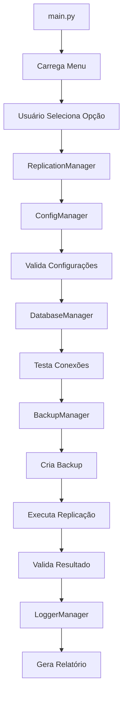

# 🏗️ Visão Geral da Arquitetura - ReplicOOP

## 📊 Arquitetura Geral

O **ReplicOOP** segue uma arquitetura modular e desacoplada, baseada nos princípios SOLID e padrões de design bem estabelecidos.

```
┌─────────────────────────────────────────────────────────────┐
│                    CAMADA DE INTERFACE                     │
│  ┌─────────────┐  ┌──────────────┐  ┌─────────────────┐   │
│  │   main.py   │  │ manager.bat  │  │   Menu System   │   │
│  │ (Menu GUI)  │  │ (Installer)  │  │   (Terminal)    │   │
│  └─────────────┘  └──────────────┘  └─────────────────┘   │
└─────────────────────────────────────────────────────────────┘
                              │
┌─────────────────────────────────────────────────────────────┐
│                   CAMADA DE NEGÓCIO                        │
│  ┌─────────────────┐  ┌─────────────────┐  ┌────────────┐  │
│  │  ReplicationMgr │  │   BackupMgr     │  │ ConfigMgr  │  │
│  │ (Orquestração)  │  │ (Segurança)     │  │(Settings)  │  │
│  └─────────────────┘  └─────────────────┘  └────────────┘  │
└─────────────────────────────────────────────────────────────┘
                              │
┌─────────────────────────────────────────────────────────────┐
│                 CAMADA DE INFRAESTRUTURA                   │
│  ┌─────────────┐  ┌─────────────┐  ┌─────────────────────┐ │
│  │ DatabaseMgr │  │ LoggerMgr   │  │     Utils           │ │
│  │ (MySQL I/O) │  │ (Auditoria) │  │  (Helpers)          │ │
│  └─────────────┘  └─────────────┘  └─────────────────────┘ │
└─────────────────────────────────────────────────────────────┘
                              │
┌─────────────────────────────────────────────────────────────┐
│                  CAMADA DE DADOS                           │
│  ┌─────────────┐  ┌─────────────┐  ┌─────────────────────┐ │
│  │   MySQL     │  │   Backups   │  │     Logs            │ │
│  │ (Produção)  │  │   (gzip)    │  │   (Arquivo)         │ │
│  │ (Sandbox)   │  │             │  │                     │ │
│  └─────────────┘  └─────────────┘  └─────────────────────┘ │
└─────────────────────────────────────────────────────────────┘
```

## 🎯 Princípios Arquiteturais

### 1. **Separação de Responsabilidades**
- **Interface**: Apenas apresentação e captura de entrada
- **Negócio**: Lógica de replicação e regras de negócio
- **Infraestrutura**: Acesso a dados e recursos externos
- **Dados**: Persistência e armazenamento

### 2. **Inversão de Dependência**
- Módulos de alto nível não dependem de baixo nível
- Ambos dependem de abstrações (interfaces)
- Facilita testes e manutenção

### 3. **Princípio da Responsabilidade Única**
- Cada módulo tem uma única responsabilidade
- Facilita manutenção e evolução
- Permite testes isolados

### 4. **Princípio Aberto/Fechado**
- Aberto para extensão, fechado para modificação
- Novos ambientes podem ser adicionados facilmente
- Novos tipos de backup podem ser implementados

## 🔄 Fluxo de Execução Principal



## 🧩 Componentes Principais

### **ReplicationManager** (Orquestrador)
```python
class ReplicationManager:
    """
    Responsabilidade: Orquestra todo o processo de replicação
    - Coordena outros managers
    - Implementa lógica de negócio
    - Trata erros e rollbacks
    """
```

### **DatabaseManager** (Persistência)
```python
class DatabaseManager:
    """
    Responsabilidade: Interface com MySQL
    - Gerencia conexões
    - Executa queries
    - Trata transações
    """
```

### **BackupManager** (Segurança)
```python
class BackupManager:
    """
    Responsabilidade: Sistema de backup
    - Cria backups automáticos
    - Compressão gzip
    - Gerencia rotação
    """
```

### **ConfigManager** (Configuração)
```python
class ConfigManager:
    """
    Responsabilidade: Gerencia configurações
    - Carrega config.json
    - Valida parâmetros
    - Fornece acesso centralizado
    """
```

## 🔀 Padrões de Design Utilizados

### 1. **Manager Pattern**
- Cada responsabilidade tem seu manager
- Centraliza operações relacionadas
- Facilita manutenção

### 2. **Context Manager Pattern**
```python
with DatabaseManager.get_connection() as conn:
    # Operações seguras
    pass
# Conexão fechada automaticamente
```

### 3. **Strategy Pattern** (Implícito)
- Diferentes estratégias de backup
- Diferentes tipos de replicação
- Extensível para novos tipos

### 4. **Command Pattern** (Menu)
- Cada opção do menu é um comando
- Facilita adição de novas funcionalidades
- Histórico de operações

## 🔧 Tecnologias e Dependências

### **Core Technologies**
```yaml
Python: "3.13+"
MySQL: "8.0+"
Charset: "utf8mb4"
```

### **Dependências Principais**
```yaml
mysql-connector-python: "8.1.0"  # Driver oficial MySQL
pymysql: "1.1.0"                 # Driver alternativo
colorama: "0.4.6"                # Cores no terminal
tabulate: "0.9.0"                # Tabelas formatadas
tqdm: "4.66.1"                   # Barras de progresso
```

### **Dependências de Desenvolvimento**
```yaml
pytest: "Para testes unitários"
black: "Formatação de código"
flake8: "Linting"
mypy: "Type checking"
```

## 📁 Estrutura de Arquivos

```
replicoop/
├── main.py              # Interface principal (Menu)
├── manager.bat          # Script de gerenciamento
├── config.json          # Configurações
├── requirements.txt     # Dependências
└── core/               # Módulos principais
    ├── __init__.py     # Inicializador
    ├── replication.py  # Motor de replicação
    ├── database.py     # Interface MySQL
    ├── backup.py       # Sistema de backup
    ├── config.py       # Gerenciamento config
    ├── logger.py       # Sistema de logs
    └── utils.py        # Utilitários
```

## 🎮 Estados do Sistema

### **Estados de Replicação**
```python
STATES = {
    'IDLE': 'Sistema aguardando comando',
    'CONNECTING': 'Estabelecendo conexões',
    'BACKING_UP': 'Criando backup de segurança',
    'ANALYZING': 'Analisando diferenças',
    'REPLICATING': 'Executando replicação',
    'VALIDATING': 'Validando resultado',
    'COMPLETED': 'Operação concluída',
    'ERROR': 'Erro durante operação'
}
```

### **Transições de Estado**
```
IDLE → CONNECTING → BACKING_UP → ANALYZING → REPLICATING → VALIDATING → COMPLETED
  ↓         ↓           ↓            ↓            ↓            ↓
ERROR ← ERROR ← ERROR ← ERROR ← ERROR ← ERROR ← ERROR
```

## 🛡️ Tratamento de Erros

### **Estratégia de Recuperação**
1. **Backup Automático**: Antes de operações destrutivas
2. **Rollback**: Em caso de falha crítica
3. **Fallback**: Remove FKs problemáticas
4. **Continuidade**: Prossegue com próximas tabelas
5. **Logging**: Registra tudo para auditoria

### **Tipos de Erro**
```python
class ReplicOOPExceptions:
    ConnectionError: "Problemas de conectividade"
    ConfigurationError: "Configuração inválida"
    BackupError: "Falha no backup"
    ReplicationError: "Erro na replicação"
    ValidationError: "Validação falhou"
```

## 🔄 Extensibilidade

### **Como Adicionar Novos Ambientes**
1. Adicionar no `config.json`
2. Atualizar `ConfigManager.get_database_config()`
3. Sistema automaticamente suporta

### **Como Adicionar Novos Tipos de Backup**
1. Herdar de `BackupManager`
2. Implementar `create_backup()` e `restore_backup()`
3. Registrar no sistema

### **Como Adicionar Novas Funcionalidades**
1. Criar novo método no `ReplicationManager`
2. Adicionar opção no menu (`main.py`)
3. Implementar testes

## 📊 Métricas e Performance

### **Otimizações Implementadas**
- **Conexões Persistentes**: Reuso de conexões MySQL
- **Processamento em Lotes**: Dados replicados em batches
- **Compressão**: Backups comprimidos com gzip
- **Índices**: Preserva estrutura de índices
- **Transações**: Operações atômicas

### **Limitações Conhecidas**
- **Foreign Keys**: Podem ser removidas em casos extremos
- **Triggers**: Não são replicados (apenas estrutura)
- **Views**: Não são replicadas
- **Procedures**: Não são replicadas

---

**Próximo**: [Diagrama de Componentes](components.md)