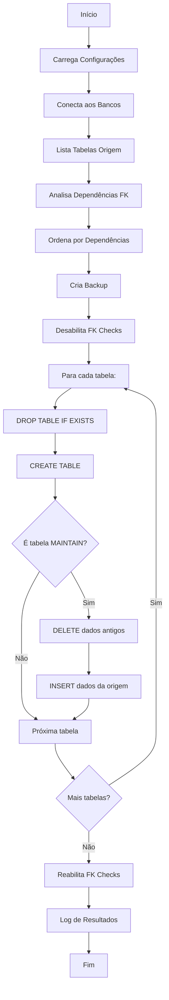

# 📋 **ReplicOOP - Documentação e Regras de Negócio**

## 🎯 **Visão Geral**

O **ReplicOOP** é um sistema completo de replicação e gerenciamento de banco de dados MySQL desenvolvido para sincronizar tabelas entre diferentes ambientes (sandbox, production, etc.) de forma inteligente e segura. O sistema inclui funcionalidades avançadas de backup, restauração e análise.

---

## 🌟 **Principais Funcionalidades**

### 🔄 **Sistema de Replicação Inteligente**
- ✅ Replicação diferenciada por tipo de tabela
- ✅ Resolução automática de dependências (Foreign Keys)
- ✅ Backup automático antes de operações
- ✅ Validação completa de integridade

### 💾 **Sistema de Backup Avançado**
- ✅ Backup completo com compressão automática
- ✅ Backup de estrutura apenas
- ✅ Metadados detalhados para cada backup
- ✅ Limpeza automática de backups antigos

### 🔙 **Sistema de Restauração Profissional** ⭐ **NOVO!**
- ✅ Análise inteligente de backups
- ✅ Validação de compatibilidade
- ✅ Restauração com backup de segurança
- ✅ Modo de simulação (dry-run)
- ✅ Comparação backup vs estado atual
- ✅ Rollback automático em caso de erro

### 📊 **Interface Profissional**
- ✅ Menu interativo intuitivo
- ✅ Logs detalhados e organizados
- ✅ Validações de segurança
- ✅ Relatórios completos

---

## 🏗️ **Arquitetura do Sistema**

### **Componentes Principais:**

```
replicoop/
├── core/                    # Módulos principais
│   ├── backup.py           # Sistema de backup
│   ├── restore.py          # Sistema de restauração ⭐ NOVO!
│   ├── config.py           # Gerenciamento de configurações
│   ├── database.py         # Conexões e operações MySQL
│   ├── logger.py           # Sistema de logs
│   ├── replication.py      # Motor de replicação
│   └── utils.py            # Utilitários gerais
├── docs/                   # Documentação
│   ├── restore.md          # Documentação de restauração ⭐ NOVO!
│   └── tests/              # Testes do sistema
├── logs/                   # Arquivos de log
├── backups/                # Backups automáticos
├── config.json             # Configurações do sistema
└── main.py                 # Interface principal
```

---

## 📋 **Regras de Negócio**

### 🎯 **1. Classificação de Tabelas**

O sistema trabalha com **dois tipos** de tabelas:

#### **📊 Tabelas MAINTAIN (Estrutura + Dados)**
- **Definição**: Tabelas listadas no arquivo `config.json` na seção `maintain_tables`
- **Comportamento**: Replicam **estrutura E dados** completos
- **Uso**: Tabelas de configuração, parâmetros, dados de referência
- **Exemplo**: `agencies`, `groups`, `roles`, `areas`, `procedures`, `steps`

```json
{
  "maintain_tables": [
    "agencies",
    "groups", 
    "roles",
    "areas",
    "procedures",
    "steps"
  ]
}
```

#### **🏗️ Tabelas NÃO-MAINTAIN (Apenas Estrutura)**
- **Definição**: Todas as outras tabelas do banco de origem
- **Comportamento**: Replicam **apenas a estrutura** (CREATE TABLE)
- **Uso**: Tabelas de dados transacionais, logs, processamento
- **Exemplo**: `processes`, `users`, `permissions`, etc.

### 🎯 **2. Processo de Replicação**

#### **🔍 Análise e Ordenação**
1. **Descoberta**: Lista todas as tabelas do banco de origem
2. **Dependências**: Analisa Foreign Keys entre tabelas
3. **Ordenação**: Ordena tabelas por dependências (topological sort)
4. **Plano**: Cria plano de execução otimizado

#### **🛠️ Execução da Replicação**
1. **Backup**: Cria backup automático do banco de destino
2. **Foreign Keys**: Desabilita verificações de FK temporariamente
3. **Estrutura**: Recria todas as tabelas (DROP + CREATE)
4. **Dados**: Para tabelas MAINTAIN, limpa e replica dados completos
5. **Restauração**: Reabilita verificações de FK

### 🎯 **3. Garantias de Integridade**

#### **📊 Estrutura Idêntica**
- **Ordem das colunas**: Preservada exatamente como na origem
- **Tipos de dados**: Replicados exatamente (VARCHAR, INT, etc.)
- **Constraints**: Primary Keys, Indexes, Foreign Keys mantidos
- **Propriedades**: NOT NULL, DEFAULT, AUTO_INCREMENT preservados

#### **💾 Dados Idênticos (Tabelas MAINTAIN)**
- **Limpeza completa**: `DELETE FROM tabela` antes da inserção
- **Cópia total**: Todos os registros copiados da origem
- **Ordem preservada**: Mesma sequência de dados
- **Integridade**: Validação de Foreign Keys após inserção

### 🎯 **4. Sistema de Segurança**

#### **🔒 Backups Automáticos**
- **Criação**: Backup automático antes de cada replicação
- **Formato**: Compressão GZIP (.sql.gz)
- **Retenção**: Mantém últimos 10 backups
- **Fallback**: Backup Python nativo se mysqldump não disponível

#### **⚠️ Tratamento de Erros**
- **Foreign Keys**: Resolução automática de dependências circulares
- **Conexão**: Retry automático em falhas temporárias
- **Rollback**: Restauração de FK checks em caso de erro
- **Logs detalhados**: Rastreamento completo de operações

---

## 🚀 **Fluxo de Execução**

### **Passo a Passo:**



---

---

## 🎮 **Menu Principal - Opções Disponíveis**

### **🔄 OPERAÇÕES DE REPLICAÇÃO:**
- **[1] - Replicar Estruturas (com opções)**: Replicação personalizada com seleção de tabelas
- **[2] - Replicar Tudo**: Replicação completa (estrutura + dados das tabelas maintain)
- **[3] - Validar Replicação**: Verifica integridade após replicação

### **💾 OPERAÇÕES DE BACKUP:**
- **[4] - Criar Backup Manual**: Backup completo do banco de destino
- **[5] - Listar Backups Disponíveis**: Mostra todos os backups com detalhes

### **🔙 OPERAÇÕES DE RESTAURAÇÃO:** ⭐ **NOVO!**
- **[6] - Restaurar Backup (Avançado)**: Sistema completo de restauração com múltiplas opções
- **[7] - Analisar Backup**: Análise detalhada do conteúdo de backups
- **[8] - Comparar Backup com Estado Atual**: Comparação entre backup e banco atual

### **🔧 CONFIGURAÇÕES E TESTES:**
- **[9] - Testar Conexões**: Valida conectividade com bancos de dados
- **[10] - Ver Plano de Replicação**: Mostra ordenação de tabelas e dependências
- **[11] - Configurar Sistema**: Assistente de configuração

### **📊 RELATÓRIOS E LOGS:**
- **[12] - Ver Logs**: Visualiza logs recentes do sistema
- **[13] - Estatísticas do Sistema**: Relatórios de desempenho e estatísticas

---

## 📊 **Configurações**

### **config.json - Estrutura:**

```json
{
  "databases": {
    "sandbox": {
      "host": "database.server.com",
      "port": 3306,
      "username": "user",
      "password": "pass",
      "dbname": "sandbox_db",
      "charset": "utf8"
    },
    "production": {
      "host": "database.server.com", 
      "port": 3306,
      "username": "user",
      "password": "pass",
      "dbname": "production_db",
      "charset": "utf8"
    }
  },
  "maintain_tables": [
    "agencies",
    "groups",
    "roles", 
    "areas",
    "procedures",
    "steps"
  ],
  "backup": {
    "max_backups": 10,
    "compress": true
  },
  "logging": {
    "level": "INFO",
    "file_logs": true
  }
}
```

---

## ⚡ **Performance e Estatísticas**

### **Métricas Típicas:**
- **33 tabelas**: ~9 segundos de execução
- **6 tabelas MAINTAIN**: Estrutura + dados completos
- **27 tabelas estruturais**: Apenas CREATE TABLE
- **Backup comprimido**: ~15-20KB
- **Logs detalhados**: Rastreamento completo

### **Otimizações:**
- ✅ Ordenação por dependências FK
- ✅ Processamento em lotes para dados
- ✅ Conexões reutilizadas
- ✅ Compressão de backups
- ✅ Logs estruturados

---

## 🛠️ **Casos de Uso**

### **1. Sincronização de Ambientes**
- Replicar estrutura do sandbox para produção
- Manter dados de configuração sincronizados
- Criar ambientes de desenvolvimento idênticos

### **2. Migração de Dados**
- Transferir estruturas entre servidores
- Backup e restore de configurações
- Clonagem de ambientes

### **3. Desenvolvimento**
- Ambiente de teste com estrutura atualizada
- Dados de referência consistentes
- Validação de mudanças estruturais

---

## 📈 **Vantagens do Sistema**

### **🎯 Inteligente**
- ✅ Diferenciação automática entre tipos de tabelas
- ✅ Resolução de dependências FK
- ✅ Ordenação otimizada de criação

### **🔒 Seguro**
- ✅ Backups automáticos
- ✅ Tratamento de erros robusto
- ✅ Validação de integridade

### **⚡ Eficiente**
- ✅ Processamento paralelo quando possível
- ✅ Logs estruturados e informativos
- ✅ Configuração flexível

### **🎮 Fácil de Usar**
- ✅ Interface interativa amigável
- ✅ Configuração via JSON
- ✅ Logs coloridos e claros

---

## 📝 **Logs e Monitoramento**

### **Tipos de Log:**
- **INFO**: Operações normais e progresso
- **WARNING**: Situações que merecem atenção
- **ERROR**: Falhas e erros de execução
- **DEBUG**: Informações técnicas detalhadas

### **Arquivos de Log:**
- **Console**: Logs coloridos em tempo real
- **Arquivo**: `logs/replicoop_YYYYMMDD.log`
- **Rotação**: Arquivos diários automáticos

---

## 🔧 **Manutenção e Troubleshooting**

### **Problemas Comuns:**
1. **Erro de FK**: Ordem incorreta de criação → Resolvido automaticamente
2. **Timeout de conexão**: Rede instável → Retry automático
3. **Tabela não encontrada**: Configuração incorreta → Validação prévia
4. **Espaço em disco**: Backups acumulados → Limpeza automática

### **Validações:**
- ✅ Teste de conectividade antes da execução
- ✅ Verificação de estruturas após replicação
- ✅ Contagem de registros para tabelas MAINTAIN
- ✅ Validação de integridade de Foreign Keys

---

*Documentação atualizada em: 11 de setembro de 2025*  
*Versão do ReplicOOP: 1.0*